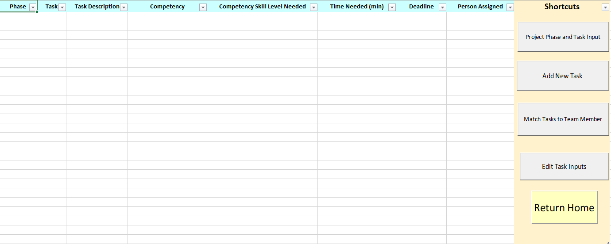
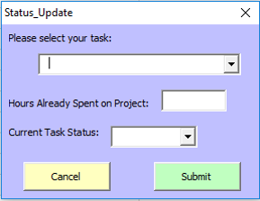

# Decision Support Tool

A decision support tool to assist teams with planning and executing projects. The tool functions as a medium for delegating and managing tasks. This project was completed in a team of six for MSCI 100: Management Engineering Concepts final project.

Technologies used include Excel VBA. 

## Application Components

#### 1. **[Home](#home)**
#### 2. **[Problem Sheet](#problem-sheet)**
#### 3. **[Project Input](#project-input)**
#### 4. **[Resources Sheet](#resource-sheet)**
#### 5. **[Mentor Matching](#mentor-matching)**
#### 6. **[Assignment Table](#assignment-table)**

## Application Functionality Details

#### 1. Home
The home provides an easy way to access specific pages of the tool and provides the current date to the user as a reminder of the time remaining for the project. The screen has specific sections for the project manager, team members, other shortcuts, and reports. 

  

[Back to Top](#top)

#### 2. Problem Sheet
This feature displays necessary information on tasks, deadlines, problem statuses, and assigned members. The group progress can be easily reviewed on this sheet as the tasks and their progress are clearly outlined.

 

The "View Specific Sheet" button introduces a pop-up user form which provides the project manager with easy access to another sheet.
 

 

The "Update Problem Status" button brings up a form that allows the project manager to update each task with its status. Possible labels include 'Addressed', 'Ongoing', and 'Not Addressed'.

 

[Back to Top](#top)

#### 3. Project Input
Only project managers have access to this page. The primary function is to guide users to input various tasks for the group project and outline the details of each task.

 

The "Project Phase and Task Input" button opens a user form to prompt the user to enter the number of team members, the number of weeks for the project, and the final project deadline.

   

When the "Add New Task" button is pressed, a form opens with fields for the task, project phase, task descriptions, task competency needed, competency skill level, estimated task completion time, and the task deadline.

  

[Back to Top](#top)

#### 4. Resources Sheet
A table is shown on this sheet for the project manager to view team members, their competencies and their available times. This feature increases the effectiveness of project managers in monitoring all group members' availability and their ability to perform outlined project tasks.

 

The "Add New User" button activates a pop-up user form that allows the project manager to add new member info and associated member information.

  

The "Edit Resources" button allows members to revise their individual member information.

  

[Back to Top](#top)

#### 5. Mentor Matching
This feature matches group members who are considered mentors to group members who are considered mentees of a specific competency.

  

[Back to Top](#top)

#### 6. Assignment Table
This feature serves as a summary sheet for the project manager and the team members to track the progress, details, and status of each project task.

  

The "Task Update" button activates a form for team members to add and update project tasks for display on the summary sheet.
  

  

[Back to Top](#top)
